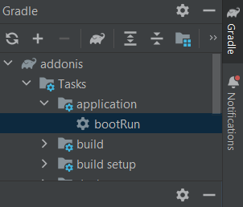
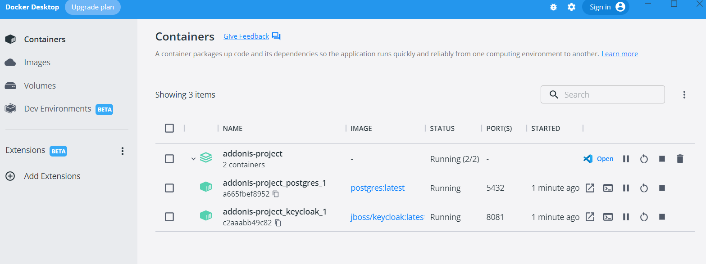
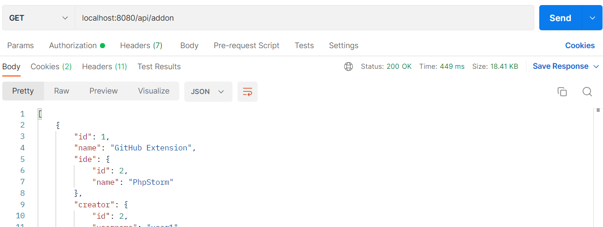
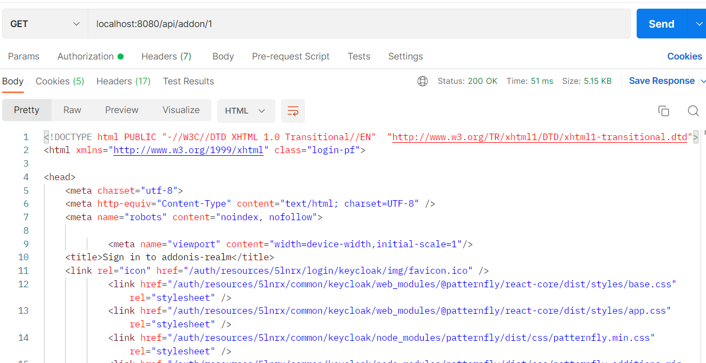
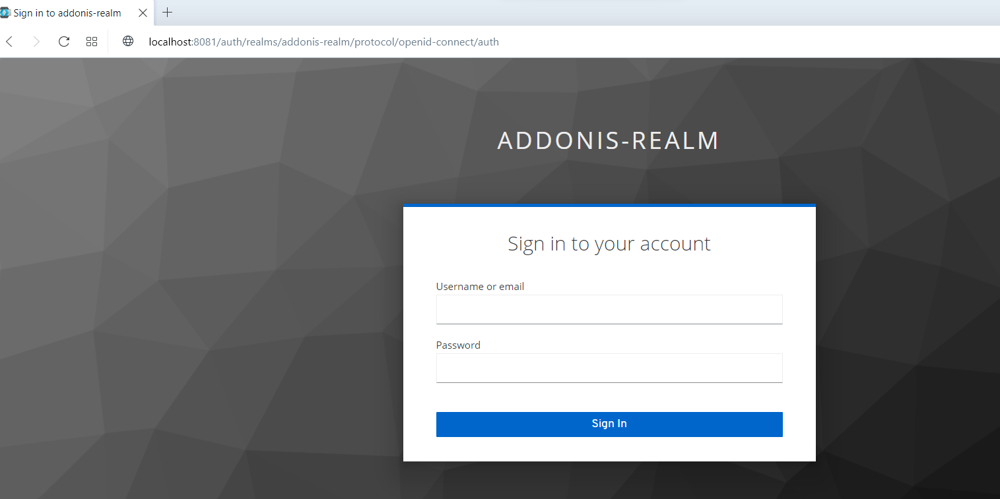
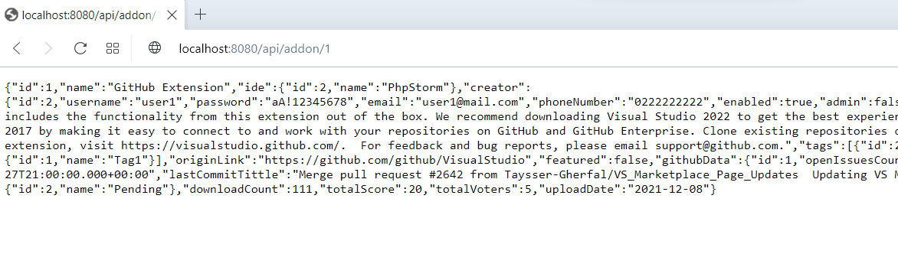
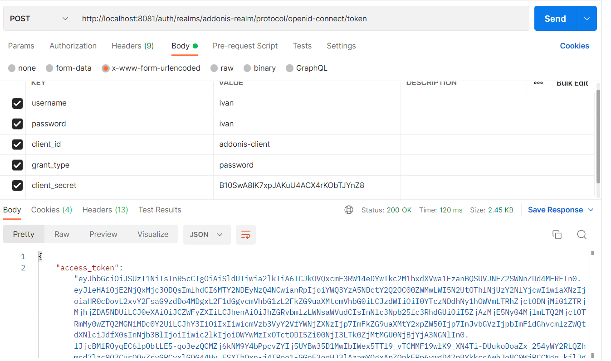
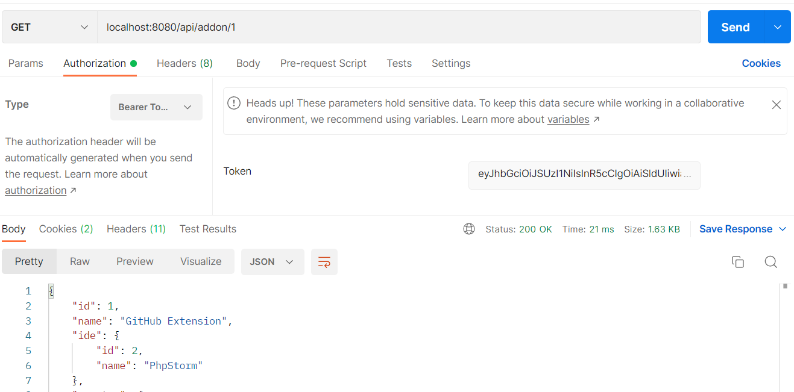

# This repository contains refactored Bgiackend of the addonis-telerik-graduate-project.
(Still no front end is available)

In order to start the application Docker Desktop is needed to instantiate the containers. Also, bootRun the application.

# Brief description:  
 - Hibernate is replaced with Spring Data JPA
 - MariaDB is replaced with PostgreSQL. The server is instantiated in Docker container (docker-compose.yml)
 - The tables in the database and the sample data in the database are created and imported using Liquibase (changeLog.xml)
 - Security layer was added using Keycloak which is instantiated in Docker container (docker-compose.yml). The embedded H2 database of the JBoss/Keycloak image was replaced with PostgreSQL database
 - Keycloak's realm setting are imported at start up using keycloak-realm-settings.json file
 - Both databases (application's and Keycloak's) are created via bash script (bash_script folder) on application start up

PostgreSQL and Keycloak containers in Docker Desktop  
 

   
     

Keycloak admin console  

 - http://localhost:8081/auth/
 - Admin dummy username: admin
 - Admin dummy password: admin

# Public endpoint preview 

- Status code 200
    

   

# Restricted endpoint preview 

- Returns status code 200 in Postman, because it actually returns the Log in page, but the resource is NOT available without authentication
        
   
    
   
    

- Must authenticate to obtain the resource (user: ivan, password: ivan)
    

   
    

- Another option to obtain the resource from the application is to use JWT (OpenId Connect)
  

  (Obtain access token)
   
    

  (Use obtained JWT for authentication)
  
 
